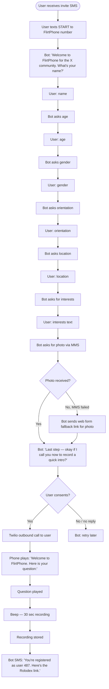
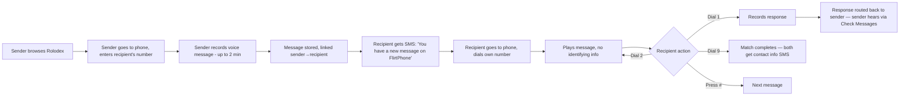

# FlirtPhone — Functional Specification
*v0.2 · ==Draft== · 2026-04-29*

| | |
|---|---|
| **Prepared by** | Nicholas |
| **Intended for** | Technical implementation / Claude build sessions |
| **Decisions Log** | [[FlirtPhone - 02 Decisions Log]] |

---

## Table of Contents

1. [[#1. Purpose]]
2. [[#2. Goals and Principles]]
3. [[#3. Users and External Entities]]
4. [[#4. Functional Modules Overview]]
5. [[#5. Registration]]
6. [[#6. Rolodex (Profile Browsing)]]
7. [[#6. Rolodex (Profile Browsing)|Functional Module — Rolodex]]
8. [[#7. Phone Interface]]
9. [[#8. Messaging]]
10. [[#9. Matching]]
11. [[#10. Profile Refresh]]
12. [[#11. Community Lifecycle]]
13. [[#12. Suggested Data Entities]]
14. [[#13. Permissions and Roles]]
15. [[#14. Non-Functional Requirements]]
16. [[#15. Implementation Roadmap]]
17. [[#16. Success Criteria]]

---

## 1. Purpose

FlirtPhone is a voice-first dating system designed for defined communities and events. It pairs a physical rotary phone (eventual hardware; website-based for MVP testing) with a companion web Rolodex. Members of a community register through a guided text/MMS flow that captures basic info, a photo, and a 30-second voice intro answering one event-specific interview question. Profiles are public on the Rolodex (real name, photo, voice intro). The discovery and matching loop is asymmetric: senders pick someone off the Rolodex deliberately and leave a voice message, which is implicitly a match request. Recipients hear messages anonymously and can dial 1 to respond, 2 to replay, or 9 to match. When the recipient dials 9, both parties receive contact info via SMS.

The product exists to create real connection within communities — house venues, yoga studios, weddings, parties — through a deliberately lo-fi, embodied, anti-dating-app interface.

---

## 2. Goals and Principles

### 2.1 Primary Goals

- Enable romantic connection within a defined community through voice
- Make discovery feel playful, embodied, and physically rooted (you have to be *there*)
- Preserve the recipient's mystery and safety: senders are accountable, recipients are protected
- Avoid the algorithmic / swipe-driven feel of mainstream dating apps

### 2.2 Core Principles

1. **Voice-first.** All meaningful communication between users is voice.
2. **Asymmetric anonymity.** Senders are known to themselves; recipients are blind until match.
3. **Sending = consent to match.** No casual messaging. Every message is intentional.
4. **Lo-fi by design.** Early-internet, analog vibes. Anti-app aesthetic.
5. **In-person engagement.** Messages can only be heard at the phone.
6. **Community-specific.** Question pools tailored to the event/space.

### 2.3 Out of Scope (MVP)

- Stagnant profile auto-detection and nudges
- Astrology / birth date / cosmic matching
- Paper Rolodex physical artifact (laminated card is enough)
- Multi-phone cross-location communities
- International SMS
- Persistent web access after a temporary event closes
- Real-time voice calls between users
- Algorithmic matching, scoring, or recommendations
- Photo galleries (one photo per profile)

---

## 3. Users and External Entities

### 3.1 Internal Users

| User | Role | Access |
|------|------|--------|
| **Admin / Host** | Creates and manages a FlirtPhone community or event | Setup interview, question pool review/approval, profile refresh trigger, community lifecycle controls |
| **Registered Member** | Has completed registration in a community | Browse Rolodex, send messages, listen to messages, respond, match |
| **Unregistered Visitor** | Has not registered (e.g., physically at the phone) | Can pick up phone and browse public voice intros only. Cannot send or match. |

### 3.2 External Entities

| Entity | Relationship |
|--------|-------------|
| Twilio | Voice call routing, SMS, MMS — for registration, notifications, contact exchange, voice recording |
| Supabase | Database, auth, storage |
| Vercel | Hosting for Rolodex + website phone interface |

---

## 4. Functional Modules Overview

| Module | Description | Phase |
|--------|-------------|-------|
| Registration | Two-part text + call flow to onboard a member | MVP |
| Rolodex | Public web profile gallery for browsing | MVP |
| Phone Interface | Voice menu for registered + visitor use; messages, responses, match | MVP |
| Messaging | Voicemail-style asynchronous turn-based exchange | MVP |
| Matching | Sender-implicit + recipient dial-9 → mutual match → SMS contact exchange | MVP |
| Profile Refresh | Admin-triggered or scheduled new-question round for all users | MVP |
| Community Lifecycle | Setup, ongoing vs. temporary, dormancy and reactivation | MVP |
| Admin Console | Setup interview, question pool review, refresh controls | MVP |

---

## 5. Registration

### 5.1 Entry Point

The admin sends a registration link via SMS to community members (manually or in bulk). The link is itself just a "text START to this number" prompt — registration runs entirely through Twilio.

### 5.2 Flow

### 5.3 Required Fields

| Field | Type | Source | Public on Rolodex? |
|-------|------|--------|---------------------|
| `phone_number` | string | Auto from sender ID | No |
| `name` | string | Text | Yes |
| `age` | int | Text | Yes |
| `gender` | string | Text | Yes |
| `orientation` | string | Text | Yes |
| `location` | string | Text | Yes |
| `interests` | string (free text) | Text | Yes |
| `photo` | image | MMS (or web fallback) | Yes |
| `voice_intro` | audio | Twilio outbound call | Yes |
| `assigned_user_number` | int (3-digit) | System-generated | Yes |
| `community_id` | uuid | From invite link context | — |

### 5.4 Behavior Rules

- Phone number is auto-detected from Twilio sender ID. Cannot be overridden.
- All fields are required for MVP. If a user abandons mid-flow, the bot retries via SMS up to 3 times before marking registration `incomplete`.
- The voice intro question is selected randomly from the community's question pool at the moment of the outbound call.
- Voice intro recording is one-take, capped at 30 seconds. No re-record option for MVP.
- User numbers are assigned at the moment registration is marked `complete`. They are random within the community and unique within the community.

---

## 6. Rolodex (Profile Browsing)

### 6.1 Description

The Rolodex is a web page (Vercel-hosted React app) that displays all registered members of a community. Each card shows:

- Photo
- Real name
- 3-digit user number
- Age, location, orientation
- Interests
- Voice intro (playable inline)
- "Send a message" call-to-action

### 6.2 Behavior Rules

- All registered members of the community are visible to all other registered members.
- The Rolodex is publicly accessible to anyone with the community URL — no auth required to *browse*. (Sending messages requires being on the physical/website phone, not the Rolodex.)
- Voice intros play inline on the Rolodex card. This is the *only* audio playable from the web — actual messages are phone-only.
- The "Send a message" button takes the user to the website phone (in MVP) with that user's number pre-loaded.

### 6.3 Filtering

- MVP: no filtering. All members visible to all browsers regardless of orientation/preference.
- Phase 2: optional filters for age, orientation, etc.

---

## 7. Phone Interface

The phone interface is the heart of the experience. In MVP, it lives as a web app (`/phone` route). In production, it ports to a Raspberry Pi-driven physical rotary phone. The state machine and audio I/O are kept abstracted to enable that port.

### 7.1 Greeting

When a user picks up the phone:

> "Welcome to FlirtPhone. Press 1 to browse profiles. Press 2 to register. Press 3 to check your messages. Press 4 to send a message to a specific user."

*Exact menu numbering is OPEN — final assignment in first build session.*

### 7.2 Browse Mode (Press 1)

- System plays voice intros from the Rolodex one at a time
- Order is random
- After each intro: "Press 9 to send this user a message. Press # for next. Press 0 to return to main menu."
- *Note:* a non-registered visitor can browse but cannot match or send.

### 7.3 Send Message Mode (Press 4)

- "Enter the 3-digit number of the user you'd like to message."
- User dials number on rotary
- System: "Recording in 3, 2, 1. After the beep, leave your message. Up to 2 minutes. Press # when done."
- Beep — recording starts
- Recording stored, marked as a `message` from sender to recipient
- This is the implicit match request from the sender
- "Message sent. Hang up to return."

### 7.4 Check Messages Mode (Press 3)

- User must enter their own 3-digit number to authenticate
- (For website phone MVP: simple verification. For physical phone: TBD in build.)
- System plays messages in order received, one at a time
- Before each: "New message."
- *NO identifying information about the sender is given.*
- After/during each message: "Press 1 to respond. Press 2 to replay. Press 9 to match. Press # for next message."

### 7.5 Recipient Actions While Listening

| Dial | Action |
|------|--------|
| **1** | Record a response (up to 2 min). Routes back to original sender. Recipient never learns sender's identity from this action. |
| **2** | Replay current message |
| **9** | Match. Triggers mutual match SMS exchange (see §9). |
| **#** | Next message |
| **0** | Main menu |

### 7.6 Greeting Variants

- First-time user (unregistered): "Welcome to FlirtPhone. Press 1 to browse profiles, or press 2 to register."
- Registered user (recognized by phone caller ID on physical phone — TBD): "Welcome back, [name]. Press 1 to browse, press 3 to check messages..."

---

## 8. Messaging

### 8.1 Message Lifecycle

### 8.2 Behavior Rules

- Maximum message length: 2 minutes
- Maximum intro length: 30 seconds
- Messages are stored permanently for the lifetime of the community
- A user can send multiple messages to the same recipient (each one is its own message; no threading)
- A recipient can respond multiple times to a sender's messages by dialing 1 each time. Each response is a discrete message.
- Responses route back to the original sender. Sender hears them via their own "Check Messages" flow. From the sender's perspective, the response is identified by name (since they know who they messaged).

### 8.3 No-Threading Model

There is no concept of a "conversation thread." Each voice message is atomic. The relationship between messages is implicit through send-respond-respond chains, not surfaced as a UI element.

---

## 9. Matching

### 9.1 Mechanic

- A sender's voice message IS the implicit match request.
- The recipient completes the match by dialing 9 while listening to (or after listening to) any message from that sender.
- Once matched, both parties receive an SMS:

> "It's a match on FlirtPhone! You and [Name] are connected. Their phone number: [###-###-####]."

- The match is one-time and permanent within the community.
- A recipient who dials 9 for a sender who has sent multiple messages — first dial-9 completes the match; subsequent dial-9s on later messages from the same sender are no-ops.

### 9.2 Edge Cases

- If the recipient hasn't received any message from the sender yet (i.e., they haven't been picked), they cannot match with that sender. There's no "I want to match with X" path that doesn't start with X messaging them.
- If the recipient blocks or ignores all messages from a sender, no match happens. The sender never knows.
- If a sender deletes their account, their messages and any pending match potential are removed.

### 9.3 Sender-Side Awareness

- Sender does NOT receive a separate "your message was heard" notification.
- Sender DOES receive the contact info SMS at the moment of mutual match.

---

## 10. Profile Refresh

### 10.1 Triggers

- **Scheduled:** Admin sets a cadence at community setup (default monthly). System auto-triggers refresh on schedule.
- **Manual:** Admin clicks "Refresh community profiles" in admin console.

### 10.2 Flow

1. Refresh triggered
2. System selects new questions from the community's pool, one per user
3. Each user receives an SMS: "FlirtPhone is refreshing the community. Reply OK and we'll call you to record a new intro."
4. User replies OK → Twilio outbound call
5. New voice intro recorded (30 sec, one take)
6. New intro replaces the old intro live on the Rolodex immediately
7. Users who don't respond to the refresh keep their existing intro

### 10.3 Behavior Rules

- All users in the community get a new question simultaneously
- Old intros are replaced, not appended (Phase 2 may keep history)
- Refresh does not affect messages, matches, or contact info

---

## 11. Community Lifecycle

### 11.1 Community Types

**Ongoing community** (e.g., yoga studio, house venue):
- No end date
- Members stay registered indefinitely
- Profile refresh runs on schedule

**Temporary community** (e.g., wedding weekend, single party):
- Admin specifies start and end date at setup
- After end date:
  - Phone system: inaccessible
  - Rolodex: inaccessible
  - All data marked dormant (NOT deleted)
  - Match contact info SMS persist on user phones — they keep what they got
- Reactivation: admin can restart the community for a new event. Existing user data is offered back to those users for reactivation rather than re-registration.

### 11.2 Setup Flow (Admin Interview)

1. Admin lands on admin onboarding URL
2. Admin enters: community name, type (ongoing / temporary), start date, end date (if temporary), expected size
3. Bot interviews admin about the event/community context (5 min for events, 15 min for ongoing)
4. System generates a candidate question pool
5. Admin reviews ALL candidate questions, removes/edits any they don't like, can add their own
6. Admin approves the pool
7. System provisions Twilio number, Rolodex URL, registration invite template
8. Admin gets dashboard: registration tracking, profile refresh button, community status

---

## 12. Suggested Data Entities

| Entity | Description |
|--------|-------------|
| `Community` | A community or event using FlirtPhone. Has type (ongoing/temporary), dates, status (active/dormant/closed), question pool, admin owner. |
| `User` | A registered member. Has community_id, phone_number (private), name, photo_url, age, gender, orientation, location, interests, voice_intro_url, assigned 3-digit number, registration status. |
| `Question` | A question in a community's pool. Has community_id, question_text, source (admin-approved or admin-added). |
| `VoiceIntro` | A user's current voice intro. Has user_id, question_id, audio_url, recorded_at. |
| `Message` | A voice message from sender to recipient. Has sender_user_id, recipient_user_id, audio_url, sent_at. |
| `Response` | A response to a message. Has message_id (parent), responder_user_id, audio_url, recorded_at. |
| `Match` | A completed match between two users. Has user_a_id, user_b_id, matched_at, community_id. |
| `Admin` | An admin user. Has phone or email, communities owned. |

---

## 13. Permissions and Roles

| Role | Permissions |
|------|-------------|
| **Admin** | Create/manage communities, run setup interview, approve question pool, trigger profile refresh, view registration metrics, close/archive community |
| **Registered Member** | Browse Rolodex, send voice messages, listen to messages, respond, match |
| **Unregistered Visitor** | Pick up physical phone, browse public voice intros, view Rolodex web page; cannot send or match |

---

## 14. Non-Functional Requirements

### 14.1 Reliability

- Voice recording must never silently fail. If a recording fails (network drop, etc.), user is notified via SMS and given another chance.
- Match SMS must be sent reliably. If Twilio fails, retry with backoff up to 3 times, then surface to admin.

### 14.2 Transparency

- Every send, response, and match is logged with timestamps for the admin (no content access — just metadata).
- Users can see their own send history if they request it (Phase 2 — for MVP, no self-history view).

### 14.3 Maintainability

- Question pools are editable post-setup (admin can add/remove questions).
- Community settings (cadence, status) are editable.

### 14.4 Portability

- Phone interface logic must be modular, with audio I/O and dial-input behind interfaces, so the Pi port can swap implementations without rewriting state machines.

### 14.5 Privacy

- Phone numbers are never displayed publicly.
- Match SMS is the only channel through which users learn each other's phone numbers.
- Admins do NOT have access to message audio or content. They have metadata only.

---

## 15. Implementation Roadmap

### MVP

- [ ] Admin onboarding + setup interview
- [ ] Question pool generation + review UI
- [ ] Twilio text/MMS conversational registration flow
- [ ] Twilio outbound call for voice intro recording
- [ ] Supabase data model + auth
- [ ] Rolodex web page (React)
- [ ] Website phone interface (React, `/phone`)
  - [ ] Browse mode
  - [ ] Send message mode
  - [ ] Check messages mode
  - [ ] Dial 1 / 2 / 9 / # actions
- [ ] Matching logic + SMS contact exchange
- [ ] Profile refresh (scheduled + manual)
- [ ] Community lifecycle (ongoing vs. temporary, dormant state)
- [ ] Modularity for hardware port (state machine + audio I/O abstractions)

### Phase 2

- [ ] Multi-question registration interviews
- [ ] Stagnant profile detection + nudges
- [ ] Astrology / cosmic matching
- [ ] Multi-phone cross-location communities
- [ ] Rolodex filters
- [ ] User self-history view
- [ ] Voice intro history (vs. just current)
- [ ] Paper Rolodex physical artifact

### Phase 3 (Hardware)

- [ ] Raspberry Pi firmware
- [ ] Rotary dial input handling
- [ ] Receiver pickup detection
- [ ] Audio I/O via Pi
- [ ] Wi-Fi connection + reconnect logic
- [ ] Physical phone shell + mounting

---

## 16. Success Criteria

> [!success] FlirtPhone is successful if:
> - [ ] A community of 20+ people registers and stays engaged for 4+ weeks
> - [ ] At least 3 mutual matches happen within the first month of an ongoing community
> - [ ] Users describe the experience as "fun," "unusual," or "delightful" in feedback
> - [ ] At least 50% of registered users send at least one message
> - [ ] Profile refresh produces measurable re-engagement (more browsing, more sends in the week after a refresh)
> - [ ] The website phone is testable, portable, and ready for clean handoff to Raspberry Pi hardware without rewrites

---

*Spec complete → [[FlirtPhone - 04 Architect]]*
