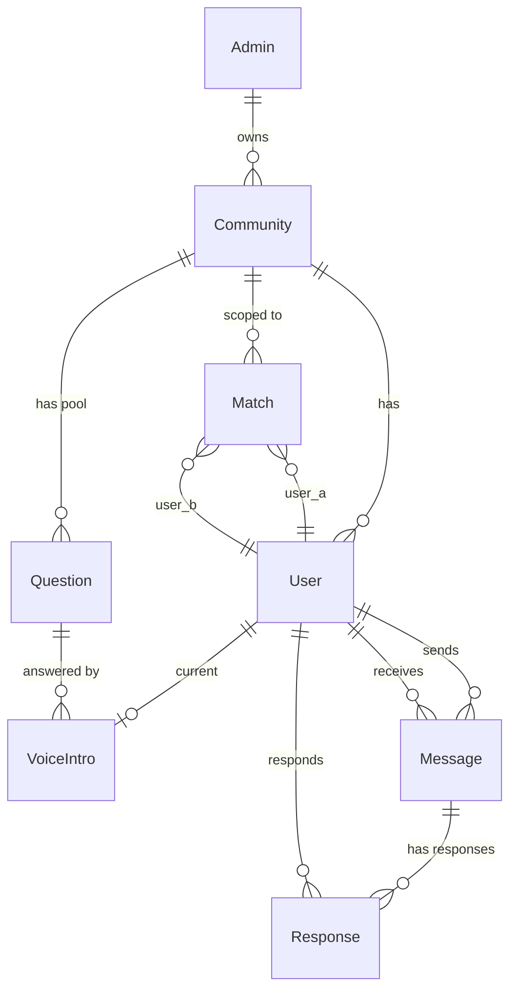

# FlirtPhone — Architect
*Stage 4 · Technical Design · 2026-04-29*

> [!abstract] How to Use
> This document answers *how* FlirtPhone gets built. It comes after the [[FlirtPhone - 03 Functional Spec]] and turns product decisions into technical decisions. The goal is that a Claude build session can start from this document without needing to make major architectural choices mid-stream.

---

## 1. Build vs. Borrow Analysis

> [!info] Definitions
> - **Adopt** — use an existing tool as-is with no custom code (near-zero cost)
> - **Wrap** — build a thin layer around something that already exists
> - **Integrate** — connect two things that don't natively talk to each other
> - **Build** — write from scratch because nothing adequate exists

| Capability | What Exists | Approach | Notes |
|------------|-------------|----------|-------|
| Voice call routing (inbound + outbound) | Twilio Programmable Voice | Adopt | Industry standard, well-supported, fits exactly |
| SMS / MMS conversational registration | Twilio Programmable Messaging | Wrap | Twilio handles transport; we wrap with conversational state machine |
| Audio recording + storage | Twilio call recording → Supabase Storage | Integrate | Twilio records, we transfer to Supabase for our control |
| Database | Supabase (Postgres) | Adopt | Schema is ours; everything else managed |
| Auth (admin) | Supabase Auth | Adopt | Email/magic link sufficient for admin |
| Auth (members) | Phone number verification via Twilio + custom | Build (thin) | Members are identified by phone — Supabase Auth doesn't fit perfectly, we'll build a phone-verification flow on top |
| Rolodex UI | React app | Build | Custom UX |
| Website phone UI | React app, `/phone` route | Build | This is the heart of the product |
| Phone state machine | n/a | Build | Modular, abstracted for Pi port |
| Hosting | Vercel | Adopt | Trivial setup, Git integration |
| Question pool generation | LLM (e.g., Anthropic API) | Integrate | Admin interview → LLM-generated questions |
| Admin console | React app, `/admin` route | Build | Custom UX |

---

## 2. Tech Stack

| Layer | Choice | Rationale | Alternatives Considered |
|-------|--------|-----------|------------------------|
| **Runtime / Language** | Node.js (latest LTS) | Operator familiarity, single-language full stack | Python, Go |
| **Backend Framework** | Express | Minimal, well-known, plenty of Twilio examples | Fastify, NestJS, Next.js API routes |
| **Frontend** | React | Operator has experience, ecosystem maturity | Vue, Svelte |
| **Frontend build / framework** | Next.js (on Vercel) | First-class Vercel integration, easy API routes for backend co-location | Vite + standalone Express |
| **Database** | Supabase (Postgres) | Managed, simple, works for production scale FlirtPhone needs | Plain Postgres, MongoDB |
| **Auth (admin)** | Supabase Auth | Free, integrated, magic link works for admin onboarding | Auth0, Clerk |
| **Auth (member)** | Custom phone-verification flow on top of Twilio | Members ARE phone numbers — Supabase Auth doesn't model that cleanly | SMS OTP via Auth0 |
| **File / Audio Storage** | Supabase Storage | One less service; sits next to the data | Vercel Blob, AWS S3 |
| **Background Jobs** | Supabase scheduled functions OR Vercel Cron | For profile refresh schedule | External cron, Inngest |
| **External APIs** | Twilio (Voice + Messaging), Anthropic API (question pool generation) | Best-in-class for each | — |
| **Deployment** | Vercel | One platform, two app sections (Rolodex + phone), simple Git-driven deploys | Render, Fly.io |
| **Version Control** | Git + GitHub | Standard | — |
| **Dev Environment** | Node.js LTS, Vercel CLI, Supabase CLI, Twilio CLI | Standard tooling | — |

> [!tip] Decision: Next.js
> The original Architect pass landed on "Node + Express + React" generically. On final pass, the cleanest path on Vercel is **Next.js** — it gives you the React frontend AND the Node backend (via API routes) in one app, in one deploy. This is consistent with the "minimize dependencies / one app, two sections" decision.

---

## 3. Application Structure

One Next.js app on Vercel, with three sections by route:

```
/ (or /rolodex)        → Public Rolodex for the community
/phone                 → Website phone interface (MVP testing surface)
/admin                 → Admin console (auth-protected)
/api/...               → Backend (Twilio webhooks, internal endpoints)
```

The community is determined by URL slug: `flirtphone.app/rolodex/{community-slug}`.

---

## 4. Data Model Sketch



### Key Entities

| Entity | Key Fields | Notes |
|--------|-----------|-------|
| `communities` | id, name, slug, type (ongoing/temporary), start_date, end_date, status (active/dormant/closed), refresh_cadence, owner_admin_id, created_at | One row per community |
| `users` | id, community_id, phone_number (unique within community), name, photo_url, age, gender, orientation, location, interests, assigned_number (3-digit, unique within community), status (registering/active/dormant), created_at | Phone number is private |
| `questions` | id, community_id, question_text, created_by_admin (bool), created_at | Pool of questions per community |
| `voice_intros` | id, user_id, question_id, audio_url, duration_seconds, recorded_at | One CURRENT intro per user; older ones may be archived |
| `messages` | id, sender_user_id, recipient_user_id, audio_url, duration_seconds, sent_at, listened_at, listened_count | The voice messages between users |
| `responses` | id, message_id (FK to messages), responder_user_id, audio_url, duration_seconds, recorded_at | Recipient's response, routed back to original sender |
| `matches` | id, community_id, user_a_id, user_b_id, matched_at, triggering_message_id | One row per matched pair |
| `admins` | id, email, created_at | Admin auth via Supabase |

### Indexes

- `users(community_id, assigned_number)` — for phone dial lookup
- `users(community_id, phone_number)` — for inbound SMS routing
- `messages(recipient_user_id, sent_at)` — for inbox playback order
- `matches(community_id, user_a_id, user_b_id)` — uniqueness constraint

---

## 5. Integration Points

### 5.1 Twilio — Inbound SMS / MMS

- **Purpose:** Conversational registration flow + responses to refresh prompts
- **Auth:** Twilio webhook signature validation
- **Direction:** Inbound (Twilio → our `/api/twilio/sms` endpoint)
- **MVP:** Yes
- **Failure behavior:** If our endpoint fails, Twilio retries. We log all inbound messages for replay.

### 5.2 Twilio — Outbound SMS

- **Purpose:** New-message notifications, match contact exchange, refresh prompts, registration nudges
- **Direction:** Outbound (our backend → Twilio API)
- **MVP:** Yes
- **Failure behavior:** Retry with exponential backoff (3 tries). Persistent failure logged for admin alert.

### 5.3 Twilio — Outbound Voice Calls

- **Purpose:** Call user during registration (and refresh) to record voice intro
- **Direction:** Outbound (our backend → Twilio API)
- **MVP:** Yes
- **Failure behavior:** If user doesn't answer or rejects, retry via SMS prompt up to 3 more times before marking registration `incomplete`.

### 5.4 Twilio — Inbound Voice Calls (Production)

- **Purpose:** When user picks up the physical phone (or website phone routes to our system), an inbound call is established or simulated
- **Direction:** Inbound (Twilio → our TwiML / WebSocket handlers)
- **MVP:** Website phone simulates this. Production uses real Twilio inbound voice.
- **Failure behavior:** Connection drops surface to user audibly: "Sorry, we lost connection. Please try again."

### 5.5 Anthropic API — Question Pool Generation

- **Purpose:** Generate candidate questions based on admin's setup interview answers
- **Direction:** Outbound (our backend → Anthropic API)
- **MVP:** Yes
- **Failure behavior:** Falls back to a default generic question pool if API fails. Admin notified.

### 5.6 Supabase Storage

- **Purpose:** Store all audio files (voice intros, messages, responses)
- **Direction:** Bidirectional
- **MVP:** Yes
- **Naming convention:** `audio/{community_id}/{type}/{user_or_message_id}.{ext}`

---

## 6. Phone State Machine (Modularity for Hardware Port)

The phone interface is the most architecturally sensitive part of the system because it must port from web to Raspberry Pi without rewrites.

### 6.1 Abstraction Boundaries

Three abstractions sit between the phone state machine and the world:

```
┌──────────────────────────────────────────┐
│  Phone State Machine (pure logic)        │
│  - Handles menu state, recording state   │
│  - Emits prompts, awaits inputs          │
└──────────┬───────────────────────────────┘
           │
   ┌───────┴───────┬──────────────┐
   ▼               ▼              ▼
┌────────┐   ┌──────────┐   ┌──────────┐
│ Audio  │   │  Input   │   │  Backend │
│ Output │   │  Source  │   │  Client  │
└────────┘   └──────────┘   └──────────┘
   │               │              │
   │               │              │
 (WebAudio /    (DOM clicks /  (REST API)
  Pi audio HW)   Pi GPIO dial)
```

- **AudioOutput** interface: `playPrompt(text)`, `playRecording(url)`, `playBeep()`. Web implementation uses WebAudio + TTS or pre-recorded prompts. Pi implementation uses ALSA / Pi audio hardware.
- **InputSource** interface: emits events `dialDigit(n)`, `pickup()`, `hangup()`, `recordingDone(blob)`. Web implementation listens to DOM events. Pi implementation listens to GPIO from rotary mechanism.
- **BackendClient** interface: same on both — REST calls to our Next.js API.

The state machine itself imports only those interfaces. Swapping web → Pi means writing two new implementations of `AudioOutput` and `InputSource`. Zero state machine changes.

### 6.2 State Machine States

```
IDLE
  ↓ (pickup)
GREETING
  ↓ (digit pressed)
MENU
  ├─ BROWSE_PROFILES
  ├─ REGISTER → (web fallback to /admin)
  ├─ CHECK_MESSAGES (auth via dialed number)
  └─ SEND_MESSAGE (enter recipient → record)

CHECK_MESSAGES
  → PLAYING_MESSAGE
      ├─ (1) → RECORDING_RESPONSE → routed to sender → PLAYING_MESSAGE (next)
      ├─ (2) → PLAYING_MESSAGE (replay)
      ├─ (9) → MATCH_TRIGGER → PLAYING_MESSAGE (next)
      └─ (#) → PLAYING_MESSAGE (next)
```

---

## 7. What Claude Will Build

> [!todo] Build Scope (ordered roughly by dependency)

- [ ] Project scaffold: Next.js app, Supabase project, Vercel deploy, env vars
- [ ] Database schema (migrations for all tables in §4)
- [ ] Twilio account setup (test number, webhooks pointing to `/api/twilio/...`)
- [ ] Admin onboarding flow + setup interview UI
- [ ] LLM question pool generation (Anthropic API integration)
- [ ] Admin console: question review/approval, refresh trigger, community status
- [ ] Twilio inbound SMS webhook + conversational state machine for registration
- [ ] MMS photo upload handling + Supabase Storage upload
- [ ] Twilio outbound call orchestration for voice intro recording
- [ ] Recording capture from Twilio → Supabase Storage
- [ ] Rolodex page (React, public, lists community members)
- [ ] Website phone interface skeleton (React, `/phone`)
  - [ ] Phone state machine (pure logic module)
  - [ ] Web AudioOutput implementation
  - [ ] Web InputSource implementation
  - [ ] BackendClient
- [ ] Browse mode
- [ ] Send message mode (record + store)
- [ ] Check messages mode (auth, playback, dial actions)
- [ ] Dial 1 → response routing back to sender
- [ ] Dial 9 → match logic + dual SMS contact exchange
- [ ] Profile refresh: scheduled (Vercel Cron) + manual trigger
- [ ] Community lifecycle: dates, dormancy, reactivation
- [ ] Logging + admin metadata views

---

## 8. File / Folder Structure

```
flirtphone/
├── docs/                          ← PDK stage docs copied at handoff
│   ├── 01-Explore.md
│   ├── 02-Decisions-Log.md
│   ├── 03-Functional-Spec.md
│   └── 04-Architect.md
├── src/
│   ├── app/                       ← Next.js app router
│   │   ├── page.tsx               ← Landing
│   │   ├── rolodex/[slug]/page.tsx
│   │   ├── phone/[slug]/page.tsx
│   │   ├── admin/...
│   │   └── api/
│   │       ├── twilio/
│   │       │   ├── sms/route.ts
│   │       │   ├── voice/route.ts
│   │       │   └── recording/route.ts
│   │       └── ...
│   ├── phone/                     ← MODULAR phone logic (port target)
│   │   ├── state-machine.ts       ← Pure logic, no DOM, no Node
│   │   ├── interfaces/
│   │   │   ├── audio-output.ts
│   │   │   ├── input-source.ts
│   │   │   └── backend-client.ts
│   │   ├── web-impl/
│   │   │   ├── web-audio-output.ts
│   │   │   └── dom-input-source.ts
│   │   └── (future) pi-impl/
│   ├── lib/
│   │   ├── supabase.ts
│   │   ├── twilio.ts
│   │   ├── anthropic.ts
│   │   └── ...
│   ├── components/                ← React UI components
│   └── server/                    ← server-side logic (registration state machine, matching, etc.)
├── supabase/
│   └── migrations/
├── CLAUDE.md
├── .env.example
├── .gitignore
├── package.json
├── tsconfig.json
└── README.md
```

---

## 9. Open Technical Questions

> [!warning] Resolve early in the first build session

- [ ] Audio storage: Supabase Storage vs. Vercel Blob — picking Supabase Storage for now (one less service), confirm during build
- [ ] Exact menu numbering on phone (MVP suggestion: 1=browse, 2=register, 3=check messages, 4=send message)
- [ ] Whether to show "X people listened to your intro" metrics to users (Phase 2)
- [ ] How website phone handles "pickup" — large button in UI? Or auto-pickup on page load with explicit "hang up" button?
- [ ] Authentication for "check messages" on website phone — entering own 3-digit number is too weak. Likely need an SMS OTP for first session, then session cookie.

---

## 10. Risk Log

| Risk | Likelihood | Impact | Mitigation |
|------|-----------|--------|------------|
| Twilio costs balloon | Med | Med | Set per-community budget caps; admin sees spend |
| Recording quality on Twilio outbound calls | Med | High | Test early with real users; fall back to "leave a voicemail" pattern if live recording is unreliable |
| MMS photo upload fails for some carriers | Med | Med | Web form fallback link in registration flow |
| Hardware port reveals state machine assumptions that don't hold | Med | High | Build abstractions strictly from day one; do a "Pi simulator" test before real Pi work |
| Recipient's blind state breaks if same sender messages many times — confusing UI | Low | Med | Clear "new message" prefix and dial-9 always available — test with real users |
| Admin question pool quality is poor | Med | Med | Show 3 examples to admin and let them iterate before approving the full pool |
| Voice intros all sound the same / not engaging | Med | High | This is what the question generation work is FOR — invest in good prompts for the LLM |
| Website phone ↔ physical phone UX divergence | Med | High | Keep phone state machine as the source of truth; don't add web-only affordances |

---

*Architect complete → ==ready for Build handoff==*
